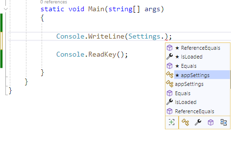
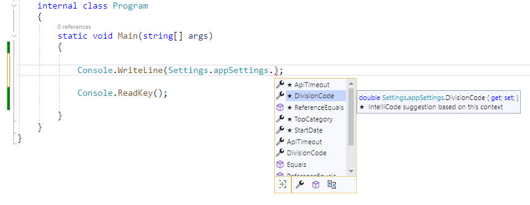
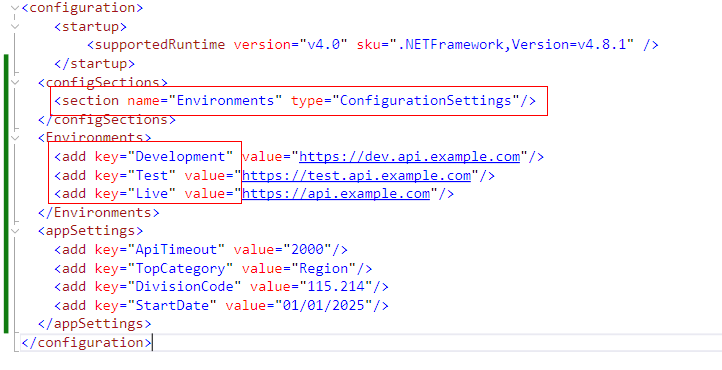
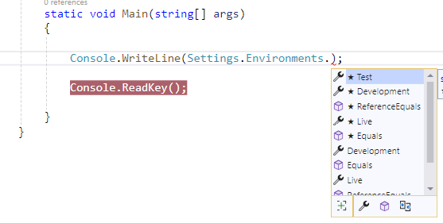
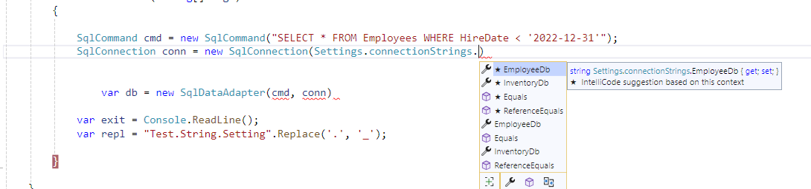
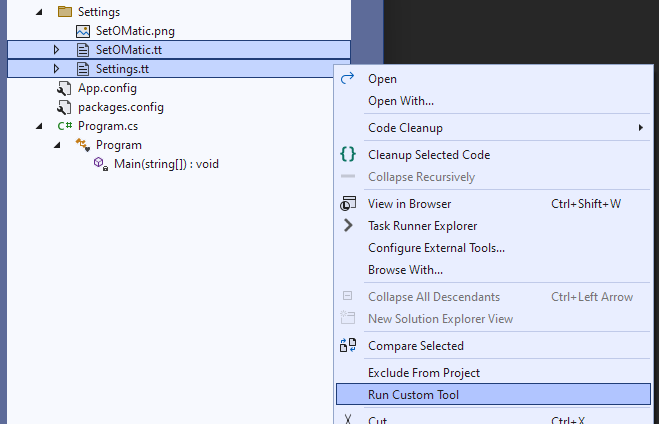

<!-- PROJECT SHIELDS -->
<!-- PROJECT LOGO -->

 

  
  <h1 align="center">Set-O-Matic</h1>

  
<strong>
    Simple strongly-typed settings manager
  </strong>
  

<!-- ABOUT THE PROJECT -->
## About Set-O-Matic

As Visual Studio has evolved, the built-in SettingsManager library has fallen far behind in functionality. While nearly all other aspects of code development have been integrated into Intellisense and have become strongly-typed, application settings are still only accessible by default as strings which are not visible via Intellisense. 

Set-O-Matic is a simple set of T4 templates that, when added to any .Net Framework project, automatically creates a strongly-typed Settings class that is dynamically loaded with values from App.config or Web.config at runtime. 

## Why use Set-O-Matic?
* Strongly-typed application settings help prevent runtime errors by allowing the compiler to check setting types at compile time
* As .Net class properties, all settings are available via IntelliSense at design-time, making selecting settings simple and error-free
* Setting values in the config file are type-checked at first setting access at runtime, preventing invalid settings from falling through the cracks
* Connection strings are automatically available through the Settings object
* Compiler-checked code is cleaner code. Help the compiler help you!

## Features
* Extremely lightweight. Set-O-Matic adds a single folder and two code files (< 200 kb)
* Completely Automates the importing of all configuration settings into a strongly typed Settings static class
* Automatically loads the current configuration file setting values at runtime into the Settings object
* Allows the use of IntelliSense to reference all application settings
* Provides a connectionString child class(es) making all connection strings available via the Settings class
* Seamlessly handles transformed config files since values are loaded at runtime
* Type-checking at application startup makes it easy to catch invalid values
* Having strongly typed settings eliminates the need to cast settings throughout the application to match the type they are being used for
* The ability to select any setting from IntelliSense greatly reduces the chances of "fat-finger" errors when referencing a setting
* Overall robustness of application code is increased due to fewer opportunities for errors
  
*Examples:*

`<add name="Active" value="true">` becomes `public bool Active {get; set;}`

`<add name="CutoffDate" value="01/01/2025">` becomes `public DateTime CutoffDate {get; set;}`
     

<!-- GETTING STARTED -->
## Getting Started

Getting started with Set-O-Matic is simple:
1.  Install
2. Start using the newly created static Settings class

### Prerequisites

Set-O-Matic works with any .Net Framework project in any Visual Studio version that supports T4 templates and uses a Web.config or App.config file. There are no additional dependencies. 

### Installation

Install the Latest [Set-O-Matic package](https://www.nuget.org/packages/SetOMatic/) using the NuGet CLI ( `$ dotnet add package SetOMatic --version 1.0.0.7` ) or NuGet Package Manager. 

The Set-O-Matic class files (`Settings.cs` and `SetOMatic.cs`) will be created automatically in a new Settings folder in the root of the project. The Settings object can then immeidiatly be referenced in code and will contain all current settings and connection strings defined in the application's App.config or Web.config file.

<!-- USAGE EXAMPLES -->
### Usage

1. To use Set-O-Matic, type `Settings.` in any code file. IntelliSense will list all available settings.
   

2. Select the setting you wish to use.
   

#### Notes

Settings that are contained in the *appSettings* section of the config file can be accessed using _`Settings.appSettings.`_
Custom application settings sections can be accessed using _`Settings.[custom_section_name].`_ :

  
  

Connection strings contained in the `connectionStrings` section of the config file can be accessed using _`Settings.connectionStrings.`_
Custom connection string sections can be accessed using `Settings.[custom connection string section name].`

  
  
### Updating settings

If settings are added to or removed from the config file, the Settings class should be updated by right-clicking on the files 

`/Settings/SetOMatic.tt`  
`/Settings.Settings.tt` 

and selecting Run custom tool`

The `Settings.cs` and `SetOMatic.cs` files will be updated with the new settings.

There is no need to regenerate the Settings.tt class after modifying setting *values* since they are loaded dynamically at runtime

